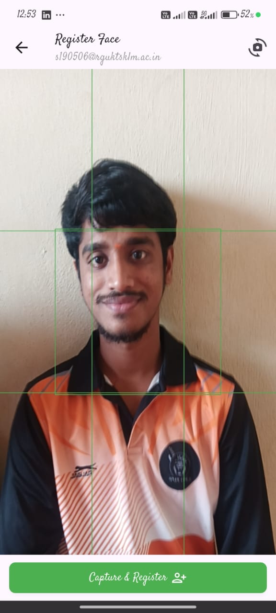
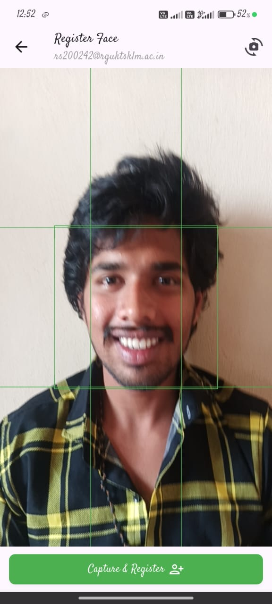

# Face Recognition App

<div align="center">
  
</div>

<div align="center">

[](https://github.com/alpharibbin/facerecognition)
[](https://flutter.dev/)
[](https://dart.dev/)
[](https://firebase.google.com/)
[](https://www.tensorflow.org/lite)

</div>

A Flutter-based face recognition application that uses TensorFlow Lite for face embedding generation and Google ML Kit for face detection. The app allows users to register faces and perform real-time face recognition.

## Tech Stack


## Screenshots

| Home Page                  | Verification User 2            | Verification User 3            |
|----------------------------|--------------------------------|--------------------------------|
|  |  |  |

| Face Registration - User 1 | Face Registration - User 2 | Face Registration - User 3 |
|----------------------------|--------------------------------|--------------------------------|
|  |  |  |

| Single Face Detection      | Multiple Faces Detection       | View All Registered            |
|----------------------------|--------------------------------|--------------------------------|
|  |  |  |

## Features

- 📸 **Face Registration**: Register faces with email and name
- 🔍 **Real-time Detection**: Detect and recognize faces in real-time using camera
- 📋 **View All Registered**: Browse all registered faces with search functionality
- 💾 **Offline Support**: Store embeddings locally using Hive for offline recognition
- ☁️ **Cloud Sync**: Sync embeddings with Firebase Firestore
- 🎯 **High Accuracy**: Uses FaceNet model for face embeddings

## Use Cases & Extended Scope

This face recognition app can be extended and adapted for various real-world applications:

### 🎓 **Class Attendance System**
- Automatically mark student attendance in classrooms
- Track attendance records with timestamps
- Generate attendance reports
- Integrate with existing student management systems

### 🏢 **Office Access Control**
- Secure entry systems for offices and buildings
- Employee identification and access management
- Visitor management systems
- Restricted area access control

### 📅 **Event Management**
- Automated check-in systems for conferences and workshops
- Event registration and attendance tracking
- VIP identification at events
- Networking event participant recognition

### 🔒 **Security & Surveillance**
- Identify authorized personnel
- Detect unauthorized access attempts
- Security monitoring systems
- Time and attendance tracking

### 🛍️ **Customer Recognition**
- Personalized service in retail stores
- Customer relationship management
- Loyalty program integration
- Hospitality industry guest recognition

### 🏥 **Healthcare Applications**
- Patient identification systems
- Staff access control in medical facilities
- Visitor management in hospitals

### 🚗 **Transportation**
- Driver identification systems
- Public transport access control
- Vehicle rental verification

**Note**: This app provides the core face recognition functionality. Additional features like attendance tracking, reporting, and integrations need to be implemented based on specific requirements.

## Tech Stack

- **Flutter**: Cross-platform mobile framework
- **TensorFlow Lite**: Face embedding generation (FaceNet model)
- **Google ML Kit**: Face detection
- **Firebase Firestore**: Cloud database for storing embeddings
- **Hive**: Local database for offline storage
- **Camera**: Real-time camera access

## Project Structure

```
lib/
├── face/
│   ├── DetectionPage.dart      # Real-time face detection
│   ├── RegistrationPage.dart   # Face registration
│   ├── VerificationPage.dart   # Email verification before registration
│   └── ViewAllRegisteredPage.dart # View all registered faces
├── services/
│   ├── detection_service.dart  # Face matching service
│   └── face_embedder.dart      # TensorFlow Lite model handler
├── models/
│   └── face_embedding.dart     # Face embedding data model
└── main.dart                   # App entry point
```

## Quick Start

### Prerequisites

- Flutter SDK (3.10.0 or higher)
- Android Studio / Xcode (for mobile development)
- Firebase project setup
- Camera-enabled device

### Installation

1. **Clone the repository**
   ```bash
   git clone https://github.com/alpharibbin/facerecognition.git
   cd facerecognition
   ```

2. **Install dependencies**
   ```bash
   flutter pub get
   ```

3. **Setup Firebase**
   - ⚠️ **Important**: This repository does NOT include Firebase configuration files
   - Follow the instructions in [SETUP_FIREBASE.md](SETUP_FIREBASE.md) or [docs/FIREBASE.md](docs/FIREBASE.md)
   - Run `flutterfire configure` to set up Firebase for your project
   - This will generate the required Firebase configuration files

4. **Add model files**
   - Place `facenet.tflite` in `assets/models/` directory
   - The model will be automatically loaded from assets on first use

5. **Run the app**
   ```bash
   flutter run
   ```

## Documentation

Comprehensive documentation is available in the `docs/` folder:

- [Setup Guide](docs/SETUP.md) - Detailed setup instructions
- [Architecture](docs/ARCHITECTURE.md) - Project architecture and design
- [Features](docs/FEATURES.md) - Detailed feature documentation
- [Firebase Setup](docs/FIREBASE.md) - Firebase configuration guide
- [API Reference](docs/API.md) - API and service documentation
- [Contributing](docs/CONTRIBUTING.md) - Contribution guidelines

## Usage

### Register a Face

1. Click the **"+"** button on the View All page
2. Enter email address in the verification page
3. (Optional) Click **"Verify"** to check if user exists
4. Enter or edit name (always enabled)
5. Click **"Continue"** or **"Add New"** to proceed to registration
6. Position face in the camera view
7. Click **"Capture & Register"** to capture 3 images and register

### Detect Faces

1. Click **"Detect Face"** on the home page
2. Point camera at faces
3. The app will automatically detect and identify registered faces
4. Supports both single and multiple face detection

### View Registered Faces

1. Click **"View All"** on the home page
2. Browse all registered faces
3. Use search to filter by name or email
4. Double-tap a face to:
   - View details
   - Register again
   - Delete (with confirmation)

## Firebase Structure

The app uses Firebase Firestore with the following structure:

```
users/
  {email}/  # Document ID is the email address
    - name: string
    - embedding: array<number>
    - face_updated_at: timestamp
```

## Requirements

- **Android**: Minimum SDK 21
- **iOS**: iOS 12.0 or higher
- **Camera**: Required for face capture and detection
- **Internet**: Required for Firebase sync (offline mode available)

## Dependencies

Key dependencies:
- `camera: ^0.11.0+2` - Camera access
- `tflite_flutter: ^0.11.0` - TensorFlow Lite
- `google_mlkit_face_detection: ^0.11.0` - Face detection
- `cloud_firestore: ^5.6.8` - Firebase database
- `hive: ^2.2.3` - Local storage
- `image: ^4.2.0` - Image processing

See [pubspec.yaml](pubspec.yaml) for complete list.

## License

This project is private and not licensed for public use.

## Repository

GitHub: [https://github.com/alpharibbin/facerecognition](https://github.com/alpharibbin/facerecognition)

## Support

For issues and questions, please open an issue on [GitHub](https://github.com/alpharibbin/facerecognition/issues).

---

**Note**: This app requires camera permissions and internet connection for full functionality.
